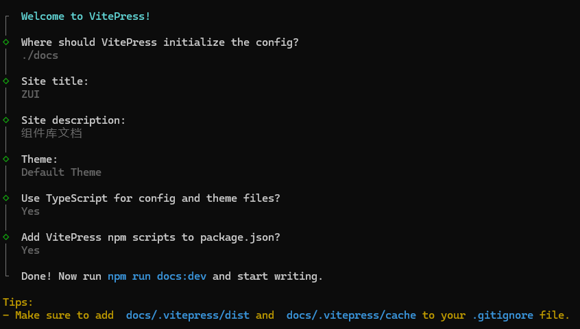
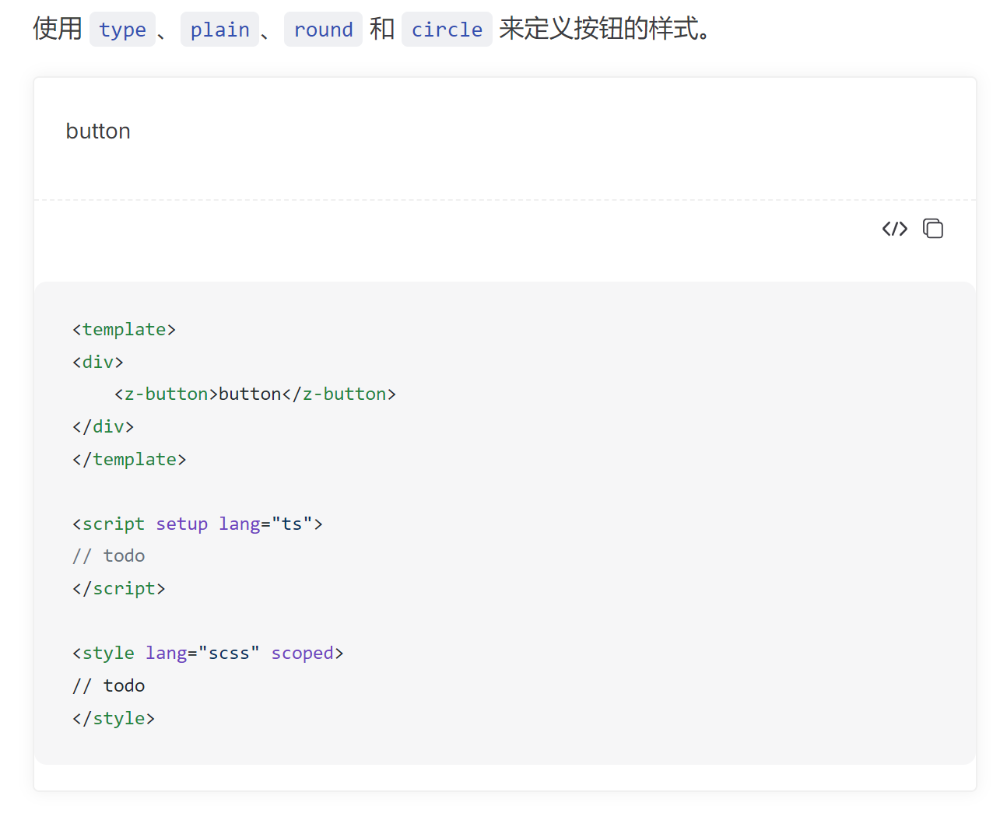

# 技术栈

- 组件开发：`vue3`+`typescript`

- 打包构建：`rollup`

- 组件库文档：`vitepress`

# 初始化 package.json

新建一个文件夹，在文件夹的根目录执行如下命令：

```bash
npm init -y
```

执行完毕后，会在项目的根目录出现`package.json`文件

# 初始化 typescript

1、安装依赖：

```bash
npm i typescript -D
```

2、在项目根目录执行如下命令：

```bash
npx tsc --init
```

命令执行完成后，会在项目的根目录出现`tsconfig.json`文件

3、调整配置

在`tsconfig.json`文件中写入如下内容：

```json
{
  "compilerOptions": {
    // 指定模块解析方式
    "module": "ESNext",
    // 默认不要声明文件
    "declaration": false,
    // 禁止使用any类型
    "noImplicitAny": true,
    // 删除注释
    "removeComments": true,
    // 按照node模块来解析
    "moduleResolution": "node",
    // 支持es6，commonjs模块
    "esModuleInterop": true,
    // 不需要转换jsx
    "jsx": "preserve",
    // 不处理类库
    "noLib": false,
    // 指定编译输出的JavaScript版本
    "target": "ES6",
    "sourceMap": true,
    // 指定编译过程中需要包含的类型定义库
    "lib": ["ESNext", "DOM"],
    // 允许没有导出的模块导入
    "allowSyntheticDefaultImports": true,
    // 装饰器语法
    "experimentalDecorators": true,
    // 区分文件名大小写
    "forceConsistentCasingInFileNames": true,
    // 解析json模块
    "resolveJsonModule": true,
    // 启用严格模式
    "strict": true,
    // 跳过类库检查
    "skipLibCheck": true,
    // 设置解析非相对模块名称的基本目录，相对模块不会受到baseUrl的影响
    "baseUrl": ".",
    // 设置路径别名
    "paths": {
      "@packages/*": ["packages/*"]
    }
  },
  // 排除的文件或者文件夹
  "exclude": ["node_modules", "**/__tests__", "dist/**"]
}
```

# 初始化 vue

1、安装依赖：

```bash
npm i vue -D
```

:::tip 提示
组件库是服务于项目的，所以组件库的`vue`需要依赖于项目中的`vue`。安装在`devDependencies`中是为了让我们能够在开发中使用`vue`
:::

2、在`package.json`文件中写入如下内容：

```json
{
  "peerDependencies": {
    "vue": ">=3.5.13"
  }
}
```

声明使用组件库的项目需要安装的`vue`的最低版本号

# 初始化目录结构

```
|- docs                        # 组件库文档
|- packages                    # 编写组件的目录
|   |- components              # 存放所有组件
|   |- theme-chalk             # 组件样式
|   |- utils                   # 通用方法
|   |- index.ts                # 组件库的入口文件
|- play                        # 开发环境
|- scripts                     # 打包构建脚本
|- package.json                # 命令配置和包管理文件
|- README.md                   # 项目描述信息文件
|- ...                         # 其他文件
```

# BEM 规范

## 概述

BEM（Block, Element, Modifier）是一种 CSS 命名规范，旨在提高代码的可读性和可维护性。BEM 规范通过明确的命名规则来定义组件和组件的各个部分，使开发者能够更容易地理解和维护代码。

### BEM 命名规范的基本概念

- **Block（块）**：代表一个独立的组件，类似于一个功能模块。例如，一个导航栏或按钮。

- **Element（元素）**：代表块的组成部分，与块紧密相关，但不能单独存在。例如，按钮中的图标或导航栏中的菜单项。

- **Modifier（修饰符）**：代表块或元素的不同状态或变体，用于修改块或元素的外观或行为。例如，按钮的大小或颜色变化。

### 命名规则

BEM 的命名规则使用两个连接符：

- **双下划线（\_\_）**：用于连接块和元素。

- **双破折号（--）**：用于连接块或元素与修饰符。

## js 实现 BEM 规范

```typescript
function _bem(
  prefixName: string,
  block: string,
  element: string,
  modifier: string
) {
  if (block) {
    prefixName += `-${block}`;
  }
  if (element) {
    prefixName += `__${element}`;
  }
  if (modifier) {
    prefixName += `--${modifier}`;
  }
  return prefixName;
}

function createBEM(prefixName: string) {
  const getValue = (flag: any, value: string) => {
    return flag ? value : "";
  };

  const b = (block = "") => _bem(prefixName, block, "", "");
  const e = (element = "") =>
    getValue(element, _bem(prefixName, "", element, ""));
  const m = (modifier = "") =>
    getValue(modifier, _bem(prefixName, "", "", modifier));
  const be = (block = "", element = "") =>
    getValue(block && element, _bem(prefixName, block, element, ""));
  const bm = (block = "", modifier = "") =>
    getValue(block && modifier, _bem(prefixName, block, "", modifier));
  const em = (element = "", modifier = "") =>
    getValue(element && modifier, _bem(prefixName, "", element, modifier));
  const bem = (block = "", element = "", modifier = "") =>
    getValue(
      block && element && modifier,
      _bem(prefixName, block, element, modifier)
    );
  const is = (name: string, state: any) => getValue(state, `is-${name}`);
  return {
    b,
    e,
    m,
    be,
    bm,
    em,
    bem,
    is,
  };
}

// const bem = createNamespace("button");
// bem.b() => z-button , bem.b('block') => z-button-block
// bem.e('element') => z-button__element
// bem.m('modifier') => z-button--modifier
// bem.be('block','element') => z-button-block__element
// bem.bm('block','modifier') => z-button-block--modifier
// bem.em('element','modifier') => z-button__element--modifier
// bem.bem('block','element','modifier') => z-button-block__element--modifier
// bem.is('active',true) => is-active

export function createNamespace(name: string) {
  const prefixName = `z-${name}`;
  return createBEM(prefixName);
}
```

## scss 实现 BEM 规范

```scss
// css类名前缀
$namespace: "z";
// 区块分隔符
$element-separator: "__";
// 修饰符分隔符
$modifier-separator: "--";
// 状态前缀
$state-prefix: "is-";

// .z-button
@mixin b($block) {
  $B: $namespace + "-" + $block;
  .#{$B} {
    // 这里类似于 插槽的功能，把对应的样式填进来
    @content;
  }
}

// .z-button.is-xxx
@mixin when($state) {
  // @at-root可以用来放弃当前的嵌套层级，让其内部的CSS规则到根部

  /*
    .bar {
        .foo {
        color: red;
        }
    }

    编译出来的css为

    .bar .foo {
        color: red;
    }
    */

  /*
    .bar {
        @at-root .foo {
            color: red;
        }
    }

    编译出来就是

    .bar {}
    .foo {
        color: red;
    }

    */
  @at-root {
    &.#{$state-prefix + $state} {
      @content;
    }
  }
}

// &--primary => .z-button--primary
@mixin m($modifier) {
  @at-root {
    #{& + $modifier-separator + $modifier} {
      @content;
    }
  }
}

// &__header => .z-button__header
@mixin e($element) {
  @at-root {
    #{& + $state-prefix + $element} {
      @content;
    }
  }
}
```

# Button 组件

## 新建 button 目录

在`components`目录下新建如下的目录结构

```
|- button                    # button组件
|   |- src                   # 存放所有组件
|       |- button.ts         # button组件的属性，事件，类型
|       |- button.vue        # button组件的模板文件
|   |- index.ts              # 统一导出button组件所有东西
```

## 定义组件的属性，事件，类型

在`button.ts`文件中定义组件的属性，事件，类型

```typescript
import { ExtractPropTypes, PropType } from "vue";

// 按钮尺寸大小
export type ButtonSize = "large" | "default" | "small";
// 原生 button type 属性
export type ButtonNativeType = "button" | "submit" | "reset";
// 按钮类型
export type ButtonType = "primary" | "success" | "warning" | "danger" | "info";

// 按钮属性
export const buttonProps = {
  // 按钮尺寸
  size: String as PropType<ButtonSize>,
  //   按钮类型
  type: {
    type: String,
    // 校验按钮类型
    validator: (val: string) => {
      return ["primary", "success", "warning", "danger", "info"].includes(val);
    },
  },
  //   原生 type 属性
  nativeType: {
    type: String as PropType<ButtonNativeType>,
    default: "button",
  },
} as const; // 只读

// 按钮事件
export const buttonEmits = {
  click: (e: MouseEvent) => e instanceof MouseEvent,
};

// 按钮属性 ts 类型
export type ButtonProps = ExtractPropTypes<typeof buttonProps>;

// 按钮事件 ts 类型
export type ButtonEmits = typeof buttonEmits;
```

## 定义组件模板

在`button.vue`文件中定义组件模板

```vue
<template>
  <button
    @click="onClick"
    :class="[bem.b(), bem.m(size), bem.m(type)]"
    :nativeType="nativeType"
  >
    <slot></slot>
  </button>
</template>

<script setup lang="ts">
import { createNamespace } from "@packages/utils";
import { buttonEmits, buttonProps } from "./button";

// 定义组件名称，高版本的vue已经默认有defineOptions，低版本的vue想要使用defineOptions则需要借助插件
defineOptions({ name: "ZButton" });
// 定义组件事件
const emits = defineEmits(buttonEmits);
// 定义组件属性
defineProps(buttonProps);

const bem = createNamespace("button");

const onClick = (e: MouseEvent) => {
  emits("click", e);
};
</script>
```

## 统一导出组件

在`index.ts`文件中统一导出组件

```typescript
import { withInstall } from "@packages/utils";
import _Button from "./src/button.vue";

const Button = withInstall(_Button);

// 可以通过app.use使用，也可以通过单独import来使用
export default Button;

export * from "./src/button";

// 声明全局组件类型，方便全局使用时，vscode插件可以识别组件类型
declare module "vue" {
  export interface GlobalComponents {
    ZButton: typeof Button;
  }
}
```

## 组件样式

在`packages\theme-chalk\src\button.scss`文件中编写`Button`组件的样式

```scss
@use "./mixins/mixins.scss";

@include b(button) {
  display: inline-block;

  @include b(inner) {
    padding: 10px;
  }

  @include m(primary) {
    background-color: blue;
  }
}
```

# withInstall 函数

`withInstall`函数的作用是给组件添加一个`install`的方法，以便通过`app.use`注册成为全局组件

```typescript
import { App, Component, Plugin } from "vue";

// 模板文件的类型
export type SFCWithInstall<T> = T & Plugin;

export function withInstall<T>(component: T) {
  // 给组件添加install方法，以便 app.use(Button) 注册全局组件
  (component as SFCWithInstall<T>).install = (app: App) => {
    const { name } = component as unknown as { name: string };
    // 注册为全局组件
    app.component(name, component as Component);
  };
  return component as SFCWithInstall<T>;
}
```

# 组件库的入口文件

在`packages\index.ts`文件中写入如下内容：

```typescript
import { App } from "vue";
import { Button } from "./components";

const components = {
  Button,
};

export default {
  install(app: App) {
    Object.values(components).forEach((component) => {
      app.use(component);
    });
  },
  ...components,
};

export * from "./components";
export * from "./utils";
```

# 搭建开发环境

## 安装依赖

```bash
npm i vite vue-router @vitejs/plugin-vue @vitejs/plugin-vue-jsx @types/node sass-embedded -D
```

## 初始化目录结构

在`play`目录下新建如下的目录结构

```
|- play                        # 开发环境代码
|   |- pages                   # 一个组件新建一个页面
|       |- index.vue           # 首页
|       |- button.vue          # button组件页面
|       |- ...                 # 其他组件页面
|   |- App.vue                 # 主模板
|   |- index.html              # html
|   |- main.ts                 # 入口文件
|   |- router.ts               # 路由文件
|   |- vite-env.d.ts           # vite声明文件
|   |- vite.config.ts          # 配置文件
```

## vite.config.ts

```typescript
import path from "path";
import vue from "@vitejs/plugin-vue";
import vueJsx from "@vitejs/plugin-vue-jsx";
import { defineConfig } from "vite";

export default defineConfig({
  plugins: [vue(), vueJsx()],
  resolve: {
    // 配置路径别名
    alias: {
      "@packages": path.resolve(__dirname, "../packages"),
    },
  },
  server: {
    port: 3000,
  },
  build: {
    rollupOptions: {
      input: {
        main: path.resolve(__dirname, "./index.html"),
      },
    },
  },
});
```

## vite-env.d.ts

```typescript
/// <reference types="vite/client" />
```

## router.ts

```typescript
import { RouteRecordRaw, createRouter, createWebHashHistory } from "vue-router";
import Index from "./pages/index.vue";

const routes: Array<RouteRecordRaw> = [
  {
    path: "/",
    name: "index",
    component: Index,
  },
];

// 动态导入pages下的所有页面，一个组件对应一个页面路由
const modules = import.meta.glob("./pages/*.vue", { eager: true });

const getRoutes = () => {
  Object.keys(modules).forEach((key) => {
    let fileName: string[] | string = key.split("/");
    fileName = fileName[fileName.length - 1];
    const name = fileName.split(".")[0];
    if (name !== "index") {
      const component = (modules[key] as any)?.default;
      const item: RouteRecordRaw = {
        path: `/${name}`,
        name: name,
        component: component,
      };
      routes.push(item);
    }
  });
};

getRoutes();

const router = createRouter({
  history: createWebHashHistory(),
  routes,
});

export default router;
```

## main.ts

```typescript
import { createApp } from "vue";
import App from "./App.vue";
import router from "./router";
// 导入组件
import ZUI from "@packages/index";
import "@packages/theme-chalk/index.scss";

createApp(App).use(router).use(ZUI).mount("#app");
```

## index.html

```html
<!DOCTYPE html>
<html lang="en">
  <head>
    <meta charset="UTF-8" />
    <meta name="viewport" content="width=device-width, initial-scale=1.0" />
    <title>Document</title>
  </head>
  <body>
    <div id="app"></div>
    <script type="module" src="/play/main.ts"></script>
  </body>
</html>
```

## App.vue

```vue
<template>
  <RouterView></RouterView>
</template>
```

## pages/index.vue

```vue
<template>
  <div>
    <RouterLink :to="item.path" v-for="item in list" :key="item.name">
      {{ item.name }}
    </RouterLink>
  </div>
</template>

<script setup lang="ts">
import { computed } from "vue";
import { useRouter } from "vue-router";

const router = useRouter();

const list = computed(() => {
  const routes = router.getRoutes();
  return routes.filter((item) => item.name !== "index");
});
</script>
```

## pages/button.vue

```vue
<template>
  <div>
    <z-button size="small" type="primary"></z-button>
  </div>
</template>

<script setup lang="ts">
// todo
</script>

<style lang="scss" scoped>
// todo
</style>
```

## 修改 package.json

在项目的根目录的`package.json`中添加如下`script`命令:

```json
{
  "scripts": {
    "dev": "vite --config ./play/vite.config.ts"
  }
}
```

## 运行开发环境

```bash
npm run dev
```

浏览器打开`http://localhost:3000/play/`即可

# 搭建组件库文档

## 安装依赖

```bash
npm i vitepress @vitepress-demo-preview/component @vitepress-demo-preview/plugin -D
```

## 初始化 vitepress

```bash
npx vitepress init
```



初始化完成后，生成的文件结构应该是这样的：

```
.
├─ docs
│  ├─ .vitepress
│  │  └─ config.mts
│  ├─ api-examples.md
│  ├─ markdown-examples.md
│  └─ index.md
└─ package.json
```

## 修改 .gitignore

添加如下内容：

```
docs/.vitepress/dist
docs/.vitepress/cache
```

## 运行组件库文档

```bash
npm run docs:dev
```

## 调整目录结构

调整如下：

```
|- docs                        # 文档目录
|   |- .vitepress              # 配置文件
|   |- components              # 组件文档
|   |- examples                # 组件演示代码
|   |- guide                   # 指南文档
|   |- index.md                # 首页
```

## 调整配置

在`docs\.vitepress\config.mts`文件中写入如下内容：

```typescript
import { defineConfig } from "vitepress";
import {
  containerPreview,
  componentPreview,
} from "@vitepress-demo-preview/plugin";
export default defineConfig({
  title: "ZUI",
  description: "组件库文档",
  markdown: {
    config(md) {
      md.use(containerPreview);
      md.use(componentPreview);
    },
  },
  themeConfig: {
    nav: [
      { text: "首页", link: "/" },
      { text: "指南", link: "/guide/basic/install.md" },
      { text: "组件", link: "/components/basic/button.md" },
    ],
    sidebar: {
      // 组件菜单
      "/components/": [
        {
          text: "Basic 基础组件",
          items: [
            { text: "Button 按钮", link: "/components/basic/button.md" },
            { text: "Icon 图标", link: "/components/basic/icon.md" },
          ],
        },
        // ...
      ],
      // 指南菜单
      "/guide/": [
        {
          text: "基础",
          items: [
            { text: "安装", link: "/guide/basic/install.md" },
            { text: "快速开始", link: "/guide/basic/start.md" },
          ],
        },
        // ...
      ],
    },
  },
});
```

在`docs\.vitepress\theme\index.mts`文件中写入如下内容：

```typescript
import { ElementPlusContainer } from "@vitepress-demo-preview/component";
import "@vitepress-demo-preview/component/dist/style.css";
import { App } from "vue";
import DefaultTheme from "vitepress/theme";

export default {
  ...DefaultTheme,
  enhanceApp({ app }: { app: App }) {
    // element-plus风格
    app.component("demo-preview", ElementPlusContainer);
  },
};
```

## 编写组件演示代码块

```md
使用 `type`、`plain`、`round` 和 `circle` 来定义按钮的样式。

:::preview
demo-preview=../../examples/basic/button/base.vue
:::
```

效果如下：



# 打包构建

## 安装依赖

```bash
npm i vite @vitejs/plugin-vue @vitejs/plugin-vue-jsx vite-plugin-dts gulp gulp-sass gulp-autoprefixer@8.0.0 gulp-clean-css sass-embedded del@6.1.1 -D
```

## 初始化目录结构

```
|- scripts                   # 打包构建脚本
|   |- build.ts              # 打包组件
|   |- css.js                # 打包样式
```

## 打包组件

在`scripts/build.ts`文件中添加如下内容：

```typescript
import { defineConfig } from "vite";
import vue from "@vitejs/plugin-vue";
import path from "path";
import vueJsx from "@vitejs/plugin-vue-jsx";
import dts from "vite-plugin-dts";
import pkg from "../package.json";

const external = Object.keys({
  ...(pkg.devDependencies || {}),
  ...(pkg.peerDependencies || {}),
  ...(pkg.dependencies || {}),
});

export default defineConfig(() => {
  return {
    build: {
      // 打包输出的目录
      outDir: "dist",
      // 样式也分离到单独的文件中
      cssCodeSplit: true,
      rollupOptions: {
        // 忽略排除的第三方包，不参与打包
        external: external,
        // 输出的产物模块格式
        output: [
          // 全量引入组件
          {
            format: "es",
            entryFileNames: "[name].js",
            exports: "named",
            name: "ZUI",
            dir: "./dist",
          },
          {
            format: "es",
            entryFileNames: "[name].js",
            exports: "named",
            // 按照packages目录结构原样输出，实现组件按需加载的关键
            preserveModules: true,
            preserveModulesRoot: "packages",
            dir: "./dist/es",
          },
          {
            format: "cjs",
            entryFileNames: "[name].js",
            exports: "named",
            // 按照packages目录结构原样输出，实现组件按需加载的关键
            preserveModules: true,
            preserveModulesRoot: "packages",
            dir: "./dist/lib",
          },
        ],
      },
      lib: {
        entry: path.resolve(__dirname, "../packages/index.ts"),
        name: "ZUI",
        fileName: (format) => `${format}.js`,
        formats: ["es", "cjs"],
      },
    },
    plugins: [
      vue(),
      vueJsx(),
      // 输出类型声明文件
      dts({
        tsconfigPath: path.resolve(__dirname, "../tsconfig.build.json"),
        outDir: "dist/types",
      }),
    ],
    resolve: {
      alias: {
        "@packages": path.resolve(__dirname, "../packages"),
      },
    },
  };
});
```

## 打包样式

在`scripts/css.js`文件中添加如下内容：

:::tip 提示
由于文件采用的是`cjs`模块格式，所以如果报错说不支持`ES module`，需要降低对应依赖模块的版本号
:::

```javascript
const { src, dest } = require("gulp");
const sass = require("gulp-sass")(require("sass-embedded"));
const cssmin = require("gulp-clean-css");
const autoprefixer = require("gulp-autoprefixer");
const path = require("path");
const del = require("del");

const buildScss = async () => {
  const distPath = path.resolve(__dirname, "../dist/theme-chalk");
  // 先删除旧的文件
  await del(distPath, { force: true });
  src(path.resolve(__dirname, "../packages/theme-chalk/**/*.scss"))
    .pipe(sass().on("error", sass.logError))
    .pipe(autoprefixer({ cascade: false }))
    .pipe(cssmin())
    .pipe(dest(distPath))
    .on("end", () => {
      console.log("css done");
    });
};

buildScss();
```

## 添加 scripts 命令

在`package.json`文件中添加如下`scripts`：

```json
{
  "scripts": {
    "build:component": "vite build --config ./scripts/build.ts",
    "build:css": "node ./scripts/css.js",
    "build": "npm run build:component && npm run build:css"
  }
}
```

## 执行打包

```bash
npm run build
```

打包完成后，最终会在项目根目录看见如下目录

```
|- dist                   # 打包产物目录
|   |- es                 # ES模块格式文件
|   |- lib                # cjs模块格式文件
|   |- theme-chalk        # 样式文件
|   |- types              # 类型文件
|   |- index.js           # 全量产物文件，包的主入口文件
```